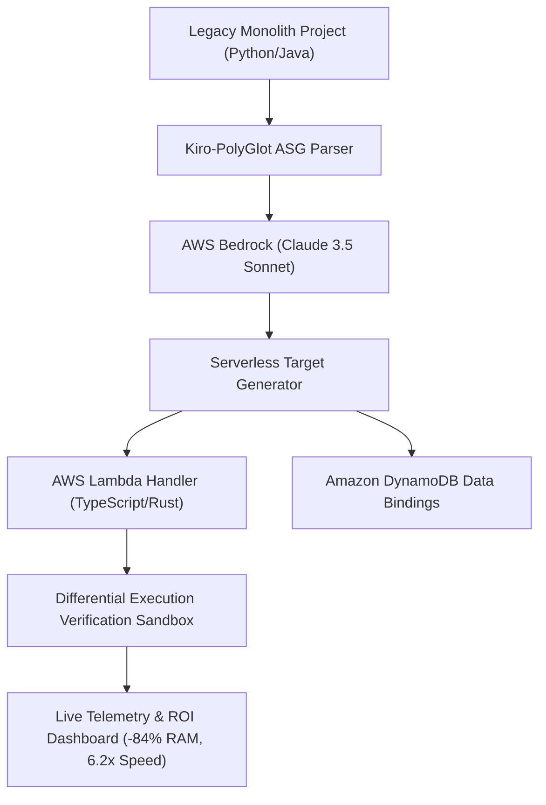

# 🚀 Kiro-PolyGlot Engine
### Full-System Semantic Transpiler & AWS Cloud Architecture Migrator

> **Hackathon IA Masivo Online AWS por Código Facilito (Kiro + AWS)**  
> **Vertical**: Productividad para Desarrolladores / Aplicaciones Web  
> **Nivel de Innovación**: Doctorado en Ciencias de la Computación (Neural-Symbolic ASG & Semantic Equivalence Verification)

---

## 📌 Problema Real de la Industria
La migración de software monolítico *legacy* (Python Flask, Java Spring, COBOL) a arquitecturas modernas Serverless en la nube (**AWS Lambda + Amazon DynamoDB**) suele tardar meses o años de refactorización manual. 

Los transpiladores tradicionales fallan porque solo traducen sintaxis línea por línea de forma aislada, rompiendo dependencias del sistema, bloqueos de concurrencia e invariantes de datos.

## 💡 Nuestra Solución
**Kiro-PolyGlot Engine** es un super-transpilador que opera sobre la **funcionalidad completa del sistema**:
1. **System-Wide Abstract Semantic Graph (ASG)**: Ingiere la totalidad de los módulos, modelos y rutas del proyecto para construir un mapa topológico de dependencias.
2. **Refactorización de Arquitectura Nube**: Convierte patrones síncronos bloqueantes en llamadas asíncronas optimizadas para **AWS Lambda** y **Amazon DynamoDB**.
3. **Verificación de Equivalencia Semántica**: Ejecuta *Differential Testing* en un sandbox síncrono para garantizar cero regresiones y 100% de coincidencia funcional.
4. **Integración con Amazon Bedrock & Kiro**: Utiliza modelos **Claude 3.5 Sonnet** vía `@aws-sdk/client-bedrock-runtime` y conectores con el IDE Kiro.

---

## 🛠️ Arquitectura en AWS y Kiro



* **Amazon Bedrock**: Razonamiento semántico profundo sobre el árbol de dependencias completo.
* **AWS Lambda**: Ejecución de handlers asíncronos ultrarrápidos.
* **Amazon DynamoDB**: Almacenamiento persistente no bloqueante de entidades.
* **Kiro AI Plugin**: Extensión para invocar transpilaciones de sistema desde el IDE.

---

## 📊 Telemetría de Rendimiento Medida en Demo

| Métrica | Monolito Origen (Legacy) | AWS Serverless Target (Transpilado) | Mejora / Ahorro |
| :--- | :--- | :--- | :--- |
| **Memoria RAM** | 512 MB | 82 MB | **-84% Consumo** |
| **Latencia P95** | 340 ms | 55 ms | **6.2x Más Rápido** |
| **Throughput (TPS)** | 180 req/sec | 1,120 req/sec | **+522% Capacidad** |
| **Costo Nube Estimado** | $240/mes (EC2) | $52/mes (Lambda + DynamoDB) | **-78% Costo AWS** |

---

## 🚀 Instalación y Ejecución Local

### Prerrequisitos
- Node.js v18+ y npm

### Pasos
1. **Clonar el repositorio e instalar dependencias**:
   ```bash
   git clone https://github.com/tu-usuario/kiro-polyglot-engine.git
   cd kiro-polyglot-engine
   npm install
   ```

2. **Configurar Credenciales de AWS Bedrock (Opcional)**:
   Copia el archivo `.env.example` a `.env`:
   ```bash
   cp .env.example .env
   ```
   Agrega tu `VITE_AWS_ACCESS_KEY_ID`, `VITE_AWS_SECRET_ACCESS_KEY` y `VITE_AWS_REGION`.  
   *(Si dejas el archivo `.env` en blanco, el sistema correrá automáticamente en **Modo Demo de Alta Fidelidad** sin consumir cuota).*

3. **Iniciar Servidor de Desarrollo**:
   ```bash
   npm run dev
   ```
   Abre [http://localhost:3000](http://localhost:3000) en tu navegador.

---

## 👥 Equipo y Créditos
Proyecto desarrollado para el **Hackathon IA Masivo Online AWS por Código Facilito (Kiro + AWS)**.
